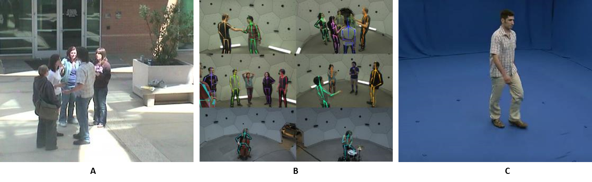

# Feature extraction via computer vision

One of the critical aspects for the detection of emotions and activities, it is the extraction of the most to determine patterns that allow for the distinction between the labels arranged for a classification task. The extraction of characteristics starts from an initial set of measured data. It creates derived values (known as features) intended to be informative and not redundant, facilitating the steps of later learning and generalization. One of the alternatives that have been most frequently addressed not only at the research level but also established as a commercial product is the use of sensors attached to the body. Within this type of alternative, there are brands such as xsense[], Nansese[], or Optitrack[] that offer specialized suits for capturing movement, providing information on the spatial location of the extremities. However, for the terms of the present work in which the use of said elements is not feasible, another alternative becomes relevant by capturing and processing images.

Under the mentioned scenario, there are alternatives such as cameras that include motion detection that suits mainly for surveillance purposes. Other hardware artifacts such as Microsoft Kinect allows the extraction of the articulation points and their positioning. However, the inconvenience of its implementation at a practical level persists, since, in the described context of the psycho-social evaluation, there would be available camera systems such as CCTV or, if applicable, the use of cameras included in mobile devices or desktops. This kind of restriction leads us to the use of software tools that can use the captured images and extract the necessary data to carry out analytical tasks on data, and consequently to identify potentials in the classification of emotions and activities. Then, we will list a set of software libraries capable of the extraction motion features.

## Motion capture libraries

Existen soluciones de software y librerias (tanto libres como comerciales) que comprenden el uso de técnicas de machine learning como deep learning, para la extracción de caracteristicas del cuerpo y tiene como objetivo mapear todos los píxeles humanos de una imagen RGB a la superficie 3D del cuerpo humano. Un ejemplo de esta aproximación es el proyecto DensePose-RCNN[@GULER2018] el cual se implementa en el marco de Detectron[@DETECTRON2018] y funciona con Caffe2 que ahora es parte del framework de machine learning, PyTorch[@pytorch2020].Otras aproximaciones se centran en el la triangulación de las articulaciones y con ello reconstruir una representación de la distrubición de las extremidades partiendo del procesamiento de imágenes en 2dimensiones. Bajo este tipo se pueden encontrar librerias de código abierto como openpose[@ZAO2019] y de tipo comercial como wrnch[@wrnch2020]. A este tipo de soluciones se pueden agregar servicios comerciales para la extracción de caracteristicas como Nanonets[@nanonets2019] y FritzAI[@fritz2019]


**This paragraph mention selected libraries and its main features**.Lorem ipsum dolor sit amet, consectetur adipiscing elit, sed eiusmod tempor incidunt ut labore et dolore magna aliqua. Ut enim ad minim veniam, quis nostrud exercitation ullamco laboris nisi ut aliquid ex ea commodi consequat. Quis aute iure reprehenderit in voluptate velit esse cillum dolore eu fugiat nulla pariatur. Excepteur sint obcaecat cupiditat non proident, sunt in culpa qui officia deserunt mollit anim id est laborum.


**The second paragrahp introduces a table which list the quantity of points detected for each library**. Lorem ipsum dolor sit amet, consectetur adipiscing elit, sed eiusmod tempor incidunt ut labore et dolore magna aliqua. Ut enim ad minim veniam, quis nostrud exercitation ullamco laboris nisi ut aliquid ex ea commodi consequat. Quis aute iure reprehenderit in voluptate velit esse cillum dolore eu fugiat nulla pariatur. Excepteur sint obcaecat cupiditat non proident, sunt in culpa qui officia deserunt mollit anim id est laborum.

**The second paragrahp list additional features of interest of the selected libraries**.Lorem ipsum dolor sit amet, consectetur adipiscing elit, sed eiusmod tempor incidunt ut labore et dolore magna aliqua. Ut enim ad minim veniam, quis nostrud exercitation ullamco laboris nisi ut aliquid ex ea commodi consequat. Quis aute iure reprehenderit in voluptate velit esse cillum dolore eu fugiat nulla pariatur. Excepteur sint obcaecat cupiditat non proident, sunt in culpa qui officia deserunt mollit anim id est laborum.


## Expermentation and benchmarking

**Figure \ref{fig:databases}**.

```{r databases,echo=FALSE, out.width='100%', fig.align='center',fig.cap="Human actions video databases."}
#
```


**This paragraph introduces the experimentation goal and experiment methodology**. Lorem ipsum dolor sit amet, consectetur adipiscing elit, sed eiusmod tempor incidunt ut labore et dolore magna aliqua. Ut enim ad minim veniam, quis nostrud exercitation ullamco laboris nisi ut aliquid ex ea commodi consequat. Quis aute iure reprehenderit in voluptate velit esse cillum dolore eu fugiat nulla pariatur. Excepteur sint obcaecat cupiditat non proident, sunt in culpa qui officia deserunt mollit anim id est laborum.

**This paragraph introduces the assesments criteria**.Lorem ipsum dolor sit amet, consectetur adipiscing elit, sed eiusmod tempor incidunt ut labore et dolore magna aliqua. Ut enim ad minim veniam, quis nostrud exercitation ullamco laboris nisi ut aliquid ex ea commodi consequat. Quis aute iure reprehenderit in voluptate velit esse cillum dolore eu fugiat nulla pariatur. Excepteur sint obcaecat cupiditat non proident, sunt in culpa qui officia deserunt mollit anim id est laborum.

```{r,echo= TRUE }
##
##
##Here there will be code to print
##tables from files.
##
##
##
##
##
##The table size will be approximately of this 
##code chunk size
##
##
```

**This paragraph lists features of the selected data bases and video frames**.Lorem ipsum dolor sit amet, consectetur adipiscing elit, sed eiusmod tempor incidunt ut labore et dolore magna aliqua. Ut enim ad minim veniam, quis nostrud exercitation ullamco laboris nisi ut aliquid ex ea commodi consequat. Quis aute iure reprehenderit in voluptate velit esse cillum dolore eu fugiat nulla pariatur. Excepteur sint obcaecat cupiditat non proident, sunt in culpa qui officia deserunt mollit anim id est laborum. Lorem ipsum dolor sit amet, consectetur adipiscing elit, sed eiusmod tempor incidunt ut labore et dolore magna aliqua. Ut enim ad minim veniam, quis nostrud exercitation ullamco laboris nisi ut aliquid ex ea commodi consequat. Quis aute iure reprehenderit in voluptate velit esse cillum dolore eu fugiat nulla pariatur. Excepteur sint obcaecat cupiditat non proident, sunt in culpa qui officia deserunt mollit anim id est laborum.

```{r,echo= TRUE }
##
##
##Here there will be code to print
##tables from files.
##
##
##
##
##
##The table size will be approximately of this 
##code chunk size
##
##
```


**Parrafo para mencionar las actividades que se van a incluir en el experimento**. Lorem ipsum dolor sit amet, consectetur adipiscing elit, sed eiusmod tempor incidunt ut labore et dolore magna aliqua. Ut enim ad minim veniam, quis nostrud exercitation ullamco laboris nisi ut aliquid ex ea commodi consequat. Quis aute iure reprehenderit in voluptate velit esse cillum dolore eu fugiat nulla pariatur. Excepteur sint obcaecat cupiditat non proident, sunt in culpa qui officia deserunt mollit anim id est laborum.

Activities
* Eating and smoking habits
* Aggresive conduct
* Recurrent extensions of work shift or activities

**Parrafo para mencionar las emociones que se van a incluir en el experimento**. Lorem ipsum dolor sit amet, consectetur adipiscing elit, sed eiusmod tempor incidunt ut labore et dolore magna aliqua. Ut enim ad minim veniam, quis nostrud exercitation ullamco laboris nisi ut aliquid ex ea commodi consequat. Quis aute iure reprehenderit in voluptate velit esse cillum dolore eu fugiat nulla pariatur. Excepteur sint obcaecat cupiditat non proident, sunt in culpa qui officia deserunt mollit anim id est laborum.
* Stress-related emotions
* Anxiety-related emotions
* Depresion-related emotions
